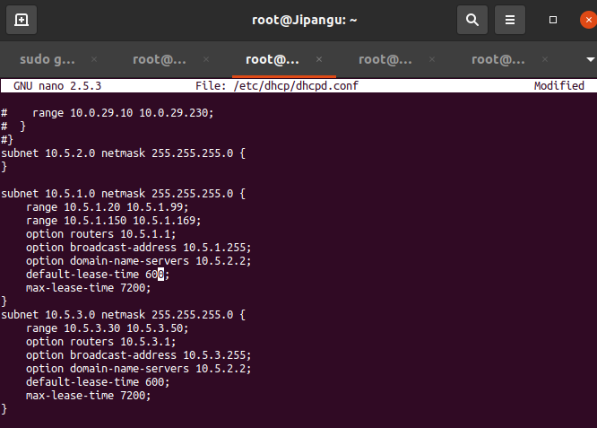

# Jarkom-Modul-3-A12-2021
Jarkom_Modul3_Lapres_A12

**Praktikum Modul 3 - Jaringan Komputer 2021**
**A12**
-   Fiqey Indriati Eka Sari (05111940000015)
-   Dyah Putri Nariswari (05111940000047)
-   Muhammad Farrel Abhinaya (05111940000173)
---

Luffy yang sudah menjadi Raja Bajak Laut ingin mengembangkan daerah
kekuasaannya dengan membuat peta seperti berikut:


Setting konfigurasi masing-masing node sebagai berikut:

**Foosha**
```

auto eth0

iface eth0 inet dhcp

auto eth1

iface eth1 inet static

address 10.5.1.1

netmask 255.255.255.0

auto eth2

iface eth2 inet static

address 10.5.2.1

netmask 255.255.255.0

auto eth3

iface eth3 inet static

address 10.5.3.1

netmask 255.255.255.0
```

**Loguetown**
```

auto eth0

iface eth0 inet static

address 10.5.1.2

netmask 255.255.255.0

gateway 10.5.1.1
```

**Alabasta**
```

auto eth0

iface eth0 inet static

address 10.5.1.3

netmask 255.255.255.0

gateway 10.5.1.1
```

**EniesLobby**
```

auto eth0

iface eth0 inet static

address 10.5.2.2

netmask 255.255.255.0

gateway 10.5.2.1
```

**Water7**
```

auto eth0

iface eth0 inet static

address 10.5.2.3

netmask 255.255.255.0

gateway 10.5.2.1
```

**Jipangu**
```

auto eth0

iface eth0 inet static

address 10.5.2.4

netmask 255.255.255.0

gateway 10.5.2.1
```

**Skypie**
```

auto eth0

iface eth0 inet static

address 10.5.3.2

netmask 255.255.255.0

gateway 10.5.3.1
```

**TottoLand**
```

auto eth0

iface eth0 inet static

address 10.5.3.3

netmask 255.255.255.0

gateway 10.5.3.1
```

Lalu pada node Foosha tuliskan command **iptables -t nat -A POSTROUTING
-o eth0 -j MASQUERADE -s 10.5.0.0/16** pada .**bashrc** dan tuliskan
command echo nameserver 192.168.122.1 \> /etc/resolv.conf pada node
lainnya.

-   **EniesLobby** sebagai DNS Server, **Jipangu** sebagai DHCP Server,
    **Water7** sebagai Proxy Server

### **1.1 Pada EniesLobby**

Kita akan membuat node EniesLobby sebagai DNS server.

### **1.1.A Instalasi Bind**

Buka EniesLobby dan buat script.sh untuk mempermudah update dan
instalasi bind9 pada EniesLobby


### **1.1.B Pembuatan Domain**

Pada sesilab ini kita akan membuat domain franky.a12.com sesuai modul 2

-   Lakukan perintah pada EniesLobby. Isikan seperti berikut: nano
     /etc/bind/named.conf.local

-   Isikan configurasi domain franky.a12.com sesuai dengan syntax
     berikut:

 zone \"franky.a12.com\" {

 type master;

 file \"etc/bind/kaizoku/franky.a12.com\";

 };

 
 

-   Buat folder kaizoku di dalam /etc/bind: mkdir /etc/bind/kaizoku

-   Copykan file db.local pada path /etc/bind ke dalam folder kaizoku
     yang baru saja dibuat dan ubah namanya menjadi franky.a12.com

 cp /etc/bind/db.local /etc/bind/kaizoku/franky.a12.com

 Kemudian buka file franky.a12.com dan edit seperti gambar berikut
 dengan IP EniesLobby vimmasing-masing kelompok: nano
 /etc/bind/kaizoku/franky.a12.com

 
 

-   Restart bind9 dengan perintah

 service bind9 restart

 ATAU

 named -g //Bisa digunakan untuk restart sekaligus debugging

### **1.2 Pada Jipangu**

Kita akan membuat node Jipangu sebagai DHCP server.

### **1.2.A Instalasi DHCP Server**

Buka Jipangu dan buat script.sh untuk mempermudah update dan instalasi
isc-dhcp-server pada node Jipangu


Lalu dijalankan script.sh untuk instalasi

### **1.2.B Konfigurasi DHCP Server**

-   Buka file konfigurasi interface dan edit file konfigurasi
     isc-dhcp-server pada /etc/default/isc-dhcp-server

-   Kita akan memilih interface eth0 untuk diberikan layanan DHCP yakni
     pada DHCP Relay

 
 

### **1.3 Pada Water7**

Kita akan membuat node Water7 sebagai Proxy server.

### **1.3.A Instalasi dan Jalankan Squid**

Buka Water7 dan buat script.sh untuk mempermudah update dan instalasi
squid pada node Water7


Selanjutnya, jalankan script.sh untuk instalasi dan start service

### **1.3.B Konfigurasi Proxy Server**

-   Backup terlebih dahulu file konfigurasi default yang disediakan
     Squid.

mv /etc/squid/squid.conf /etc/squid/squid.conf.bak

-   Buat konfigurasi Squid baru Pada file /etc/squid/squid.conf

-   Kemudian, pada file config yang baru, masukkan script
     :
     

-   Restart squid dengan cara mengetikkan perintah:

 service squid restart

### Soal 2 <br>

-   **Foosha** sebagai DHCP Relay

**Jawaban** <br>
**Pada Foosha**

1.  Buat script.sh untuk mempermudah selama pengerjaan, dengan instalasi
     isc-dhcp-relay


2.  Jalankan script.sh

3.  Atur /etc/default/isc-dhcp-relay dengan Server berisi IP EniesLobby
     selaku DHCP Server, INTERFACES eth1 eth2 eth3 dikarenakan
     interfaces yang memerlukan dari router Foosha di Switch1, Switch2,
     Switch3.


4.  Jalankan service isc-dhcp-relay start

5.  Dan cek status dengan service isc-dhcp-relay status

### Soal 3-4 <br>
Client yang melalui Switch1 mendapatkan range IP dari \[prefix
IP\].1.20 - \[prefix IP\].1.99 dan \[prefix IP\].1.150 - \[prefix
IP\].1.169 & Client yang melalui Switch3 mendapatkan range IP dari
\[prefix IP\].3.30 - \[prefix IP\].3.50

**Jawaban** <br>
-   Buka file konfigurasi DHCP dengan perintah nano /etc/dhcp/dhcpd.conf

-   Edit file konfigurasi isc-dhcp-server pada /etc/dhcp/dhcpd.conf
     dengan menambahkan option router dengan subnet gateway dari
     interface yang melewati Switch 2

-   Tambahkan script berikut
```

 subnet 10.5.1.0 netmask 255.255.255.0 {

 range 10.5.1.20 10.5.1.99;

 range 10.5.1.150 10.5.1.169;

 option routers 10.5.1.1;

 option broadcast-address 10.5.1.255;

 option domain-name-servers 10.5.2.2

 default-lease-time 360;

 max-lease-time 7200;

 }

 subnet 10.5.2.0 netmask 255.255.255.0 {

 }

 subnet 10.5.3.0 netmask 255.255.255.0 {

 range 10.5.3.30 10.5.3.50;

 option routers 10.5.3.1;

 option broadcast-address 10.5.3.255;

 option domain-name-servers 10.5.2.2;

 default-lease-time 720;

 max-lease-time 7200;

 }
 ```

-   


-   Cek dan jalankan dhcp-server
    
    
    
     

-   Client yang melalui Switch 1 telah mendapatkan IP DHCP yang sesuai
     range yaitu range IP dari \[prefix IP\].1.20 - \[prefix IP\].1.99
     dan \[prefix IP\].1.150 - \[prefix IP\].1.169

 
 

-   Client yang melalui Switch 3 telah mendapatkan IP DHCP yang sesuai
     range yaitu range IP dari \[prefix IP\].1.30 - \[prefix IP\].1.50

### Soal 5 <br>
Client mendapatkan DNS dari EniesLobby dan client dapat terhubung
dengan internet melalui DNS tersebut.

**Jawaban** <br>
1.  DNS server harus disetting **DNS Forwarde**r. Di enies di setting
     forwarder /etc/bind/named.conf.options

 
 

2.  Testing di LogueTown sebagai Client

 
 

### Soal 6 <br>
Lama waktu DHCP server meminjamkan alamat IP kepada Client yang melalui Switch1 selama 6 menit sedangkan pada client yang melalui Switch3 selama 12 menit. Dengan waktu maksimal yang dialokasikan untuk peminjaman alamat IP selama 120 menit.

**Jawaban** <br>
Pada node Jipangu, mengubah default-lease-time menjadi 360 dan 720 (dalam seconds) dan max-lease-time 7200 (dalam seconds) pada /etc/dhcp/dhcpd.conf


----------------------------------------

### Soal 7 <br>
Luffy dan Zoro berencana menjadikan Skypie sebagai server untuk jual beli kapal yang dimilikinya dengan alamat IP yang tetap dengan IP [prefix IP].3.69

**Jawaban** <br>
Pada Skypie, mengubah /etc/network/interfaces sebagai berikut<br>


Pada Jipangu, menambahkan konfigurasi seperti berikut pada /etc/dhcp/dhcpd.conf
```
host Skypie {
  hardware ethernet de:e3:b3:35:e7:6b;
  fixed-address 10.5.3.69
}
```
Restart dengan command ```service isc-dhcp-server restart```

Lalu, stop dan start kembali Skypie pada GNS3 dan cek menggunakan command ```ip a```


---------------------------------------------------

### Soal 8
Pada Loguetown, proxy harus bisa diakses dengan nama jualbelikapal.yyy.com dengan port yang digunakan adalah 5000

**Jawaban**
Pada EniesLobby tambahkan konfigurasi sebagai berikut pada /etc/bind/named.conf.local


Lalu, buat directory dengan command ```mkdir /etc/bind/kaizoku```

Edit konfigurasi pada /etc/bind/kaizoku/jualbelikapal.a12.com


Restart bind9 dengan command ```service bind9 restart```

Pada Water7, install squid dengan command ```apt-get install squid -y```. Lalu, start dengan command ```service squid start```.

Setelah itu, buat backup files (move and rename) squid.conf dengan command ```mv /etc/squid/squid.conf /etc/squid/squid.conf.bak```

Pada /etc/squid/squid.conf ubah sebagi berikut dan tambahkan ```http_access allow all```


Restart squid dengan command ```service squid restart```

Setelah install lynx, pada Loguetown lakukan command ```export http_proxy="http://10.5.2.3:5000”```. Lalu, periksa apakah konfigurasi telah berhasil dengan command ```env | grep -i proxy```


--------------------------------------

### Soal 9
Agar transaksi jual beli lebih aman dan pengguna website ada dua orang, proxy dipasang autentikasi user proxy dengan enkripsi MD5 dengan dua username, yaitu luffybelikapalyyy dengan password luffy_yyy dan zorobelikapalyyy dengan password zoro_yyy

**Jawaban**
Pada Water7, install apache2 dengan command ```apt-get install apache2 -y```. Setelah itu, tuliskan command ```htpasswd -c /etc/squid/passwd luffybelikapala12``` dan
```htpasswd -c /etc/squid/passwd zorobelikapala12```. Lalu, masukkan password nya yang sesuai. Setelah itu restart squid nya.<br>


Pada /etc/squid/squid.conf tambahkan kofigurasi sebagai berikut <br>


